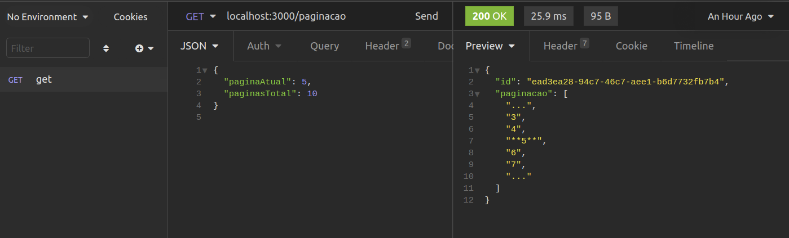

# Api_paginação

Bem vindo a api de paginação, esta é uma api de uma rota apenas e um método get, porém foi desenvolvida seguindo as boas práticas, tornando assim seu escalonamento muito fácil.
A api consiste em o usuário informar a página atual e o total de páginas, como resultado é retornado um array de strings com um limite de 5 páginas, destacando a página atual, como mostra o exemplo:

## Utilização

Clone o projeto para sua máquina, acesse a pasta do projeto e rode o comando `npm install`, com as dependências do projeto instaladas já é possível rodar a aplicação, execute o comando `npm start` para iniciar a aplicação ou `npm run dev` para iniciar em modo de desenvolvimento.

Com a aplicação rodando já é possível realizar requisições para Api. O usuário deve informar a atual e o total de páginas em um método GET para a o endpoint 'localhost:3000/paginacao', assim como mostra a imagem:

São feitas algumas validações em que o usuário deve se atentar, como por exemplo:
* As chaves "paginaAtual" e "paginasTotal" são obrigatorias.
* A página atual não deve ser maior que o total de páginas.
* Os valores informados devem ser do tipo number, inteiros e positivos.

Caso alguma dessas regras seja violada o usuário receberá como resposta da requisição um status code 400 e uma mensagem com mais detalhes do erro.

Para rodar os teste da aplicação basta executar o comando `npm test`.
